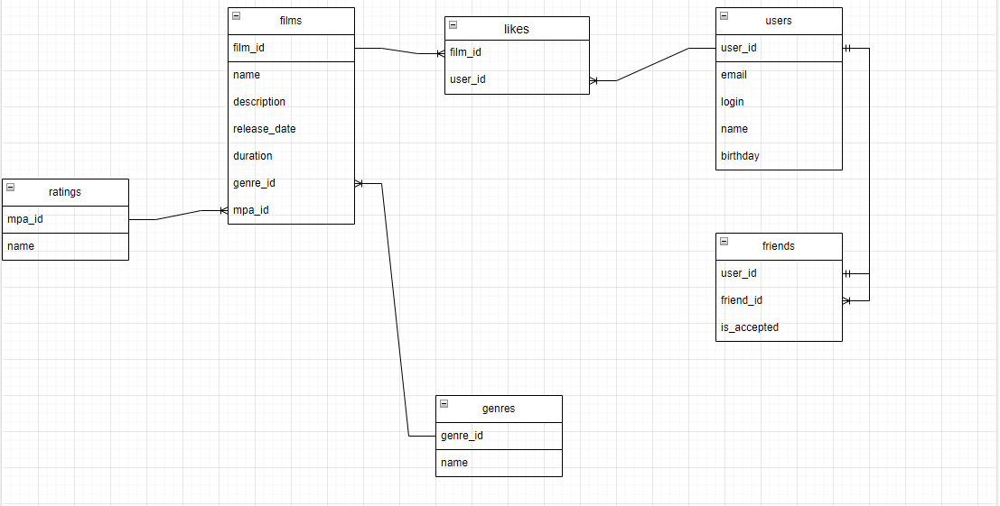

# java-filmorate
Template repository for Filmorate project.

--
поиск друзей пользователя
select u.user_id, u.email, u.login, u.name, u.birthday
from users as u
inner join friends as f on f.user_id = u.user_id
where f.friend_id = {id} and f.is_accepted = true

--
поиск количества лайков к фильму
select count(l.user_id)
from likes as l
where l.film_id = {id}

--
поиск друзей пользователя, которым понравился этот же фильм
select u.user_id, u.email, u.login, u.name, u.birthday
from users as u
inner join friends as f on f.user_id = u.user_id
inner join likes as l on l.user_id = u.user_id
where f.friend_id = {userId} and f.is_accepted = true and l.film_id = {filmId}

--
поиск фильмов, к которым не поставили лайков
select f.name, f.description, f.release_date, f.duration, f.genre_id, f.mpa_id
from films as f
left join likes as l on l.film_id = f.film_id
where l.film_id is null